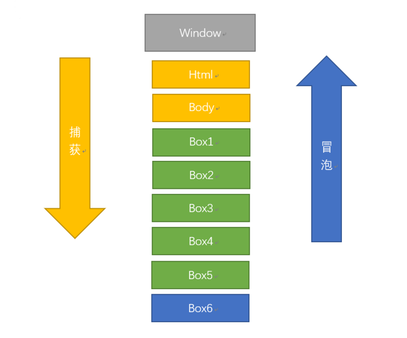

# 事件详解

## 上节课重点知识回顾
- 滚动条位置获取
    - document.body.scrollTop||document.documentElement.scrollTop
    - document.body.scrollLeft||document.documentElement.scrollLeft
    - window.scrollX、window.scrollY
    - window.scrlllTo(x,y)
- 获取尺寸相应方法
    - 获取可视区尺寸
        - document.documentElement.clientWidth/document.documentElement.clientHeight
        - window.innerWidth/window.innerHeight
    - 获取页面尺寸
        - document.body.scrollWidth、document.body.scrollHeight
    - 获取屏幕尺寸
        - screen.width、screen.height
    - 元素相关尺寸
        - el.offsetWidth、el.offsetHeight 可视宽高（width/height + padding + border）
        - el.offsetLeft、el.offsetTop 元素距离可视父级的距离
        - el.clientWidth、el.clientHeight 元素宽高 (width/height + padding)
        - el.clientLeft、el.clientTop 元素的左/上边框宽度
        - el.scrollWidth、el.scrollHeight 元素内容宽高 (如果元素内容宽/高度小于元素高度时，则是元素宽/高)
        - getBoundingClientRect()
            - width、height 可视宽高（width/height + padding + border）
            - top、bottom 元素顶/底部距离可视区顶部距离
            - left、right 元素左/右部距离可视区顶部距离
        - 获取元素页面绝对坐标
            - 高版本写法
            - 兼容写法
- BOM 五大对象
    - window JS 在浏览器中的顶层对象，var 和 function 声明的全局函数都是挂载window的属性中
    - navigator 浏览器相关信息 (浏览器型号、版本、系统版本、网络信息等)
    - location 地址栏信息 (hash、search、href)
    - history 历史记录 (go、back、forward)
    - screen 屏幕信息 (width、height)

## 课程目标
- 玩转事件监听，明白事件监听和事件绑定的区别
- 了解事件对象，明确事件对象的获取
- 搞懂事件流：捕获、target、冒泡
- 玩转事件代理
- 自定义右键菜单

## 正课内容
- 事件监听
target.addEventListener(type, listener[, options|useCapture]) 添加事件监听
参数：
   type 事件类型 (click、mouseover等，注意这里不加on)
   listener 事件处理函数

可选参数：
    options 配置对象
        capture:  Boolean，表示 listener 会在该类型的事件捕获阶段传播到该 EventTarget 时触发。
        once:  Boolean，表示 listener 在添加之后最多只调用一次。如果是 true， listener 会在其被调用之后自动移除。
        passive: Boolean，设置为true时，表示 listener 永远不会调用 preventDefault()。如果 listener 仍然调用了这个函数，客户端将会忽略它并抛出一个控制台警告。
    useCapture Boolean，表示 listener 会在该类型的事件捕获阶段传播到该 EventTarget 时触发。
    第三个参数不设置时，默认执行的是 useCapture 为 false 也就是在冒泡阶段执行

- 取消事件监听
    removeEventListener(type, listener[, options|useCapture])

- 事件绑定与事件监听的区别

- 事件流

事件捕获：当事件发生时，最先得到通知的是window，然后是document，由上至下逐级依次而入，直到真正触发事件的那个元素(目标元素)为止，这个过程就是捕获。
事件冒泡：接下来，事件会从目标元素开始起泡，由下至上逐级依次传播，直到window对象为止，这个过程就是冒泡。

- mouseenter和mouseleave 事件
    - mouseover 事件 和 mouseout 事件的问题

- 事件对象
    事件对象中包含了事件的详细信息，如果键盘按键，鼠标滚动方向，鼠标按键等事件详细信息
    - 兼容的事件对象获取方法
    - e.bubbles 是否冒泡
    - e.stopPropagation() 和 e.cancelBubble
    - 完整版：自定义下拉菜单

- 事件代理(事件委托)  
    - e.target 事件源
    事件代理(事件委托)：利用冒泡机制将事件统一委托在父级上执行，在通过事件源获取到相关元素
    - 优点：1)减少事件注册，节省内存; 2)可以给将来的元素添加事件
    - 缺点：1)建议就近委托，否则会导致浏览器频繁的调用处理函数;2)容易出现误判，所以写好相应判断

- 自定义右键菜单
    - contextmenu 右键菜单事件
    - e.preventDefault()/return false 阻止默认事件
    - e.clientX/e.clientY 鼠标位置获取

## 总结
- 事件监听
- 捕获 -> 事件源 -> 冒泡
- 添加事件的意思：给元素对应的事件添加一个处理函数，并不是加一个事件进去。事件，在元素生成时就已经定义好了
- 事件对象：e.target 事件源， e.stopPropagation() 和 e.cancelBubble 取消冒泡
- 事件代理

## 今天任务
1. 掌握今日相关理论知识点
2. 完成今天课程中的相关案例

## 下节课预告
0. 阻止默认事件，鼠标位置获取
1. 自定义右键菜单
2. 放大镜效果
3. 拖拽原理
4. 鼠标滚动事件
5. 自定义滚动条
    

